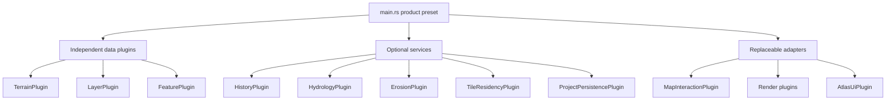
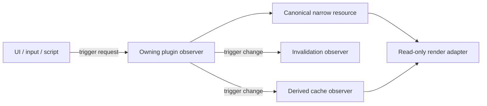

# Architecture

## Composition, not central ownership

`main.rs` is a product preset. Its list of plugins is the only place where the current editor application is assembled. Removing a render, simulation, history, UI, or demonstration-content plugin removes that capability without changing the authoritative data modules.

There is deliberately no `KoviaAtlasPlugin`, `AtlasWorld`, `WorldModel`, central update chain, or UI-owned mutation path.

## Plugin contracts

| Plugin | Canonical resource | Inputs | Outputs |
|---|---|---|---|
| `PlanetPlugin` | `PlanetSpec` | none | stable spatial reference |
| `TerrainPlugin` | `TerrainStore` | `SculptTerrain`, `ApplyHeightProposal` | `TerrainChanged`, `TerrainEditFailed` |
| `LayerPlugin` | `LayerRegistry`, `LayerStore` | create/configure/paint events | created/changed/failure events |
| `FeaturePlugin` | `FeatureStore` | `PlaceSettlement` | `FeatureChanged` |
| `HistoryPlugin` | `EditHistory` | `Undo`, `Redo` | `HistoryOutcome` and domain change events |
| `ChangeTrackingPlugin` | `DirtyTracker` | domain change events | dirty product flags |
| `HydrologyPlugin` | `HydrologyCache` | `ComputeHydrology`, `TerrainChanged` | updated/failure events |
| `ErosionPlugin` | none | `RunErosion` | `ApplyHeightProposal` |
| `TileResidencyPlugin` | `TileResidencyManager` | tile policy calls | eviction candidates |
| `ProjectPersistencePlugin` | `ProjectPath`, `ProjectSession` | `SaveProject`, `LoadProject` | saved/loaded/failure events |
| `EditorStatePlugin` | small intent resources | UI/input changes | shared editor intent |
| `MapCameraPlugin` | `ViewportInputCapture` | mouse messages | camera transform |
| `MapInteractionPlugin` | none | viewport gestures | domain edit events |
| `TerrainRenderPlugin` | ECS render cache | terrain/layer reads | meshes and materials |
| `HydrologyOverlayRenderPlugin` | none | hydrology/terrain reads | gizmo overlay |
| `AtlasUiPlugin` | UI style only | user widgets and domain outcomes | domain events and editor intent |
| `StarterWorldPlugin` | none | startup | optional demonstration content |

## Event flow

Bevy 0.19 observer events are the public capability boundary. An adapter triggers a semantic request. The owning domain observer applies it and triggers a change event. Other plugins react without being called directly.

No observer may assume ordering relative to another observer watching the same event. A required sequence must be represented as a second explicit event or as ordered ordinary systems.

## Data ownership

Terrain, layers, and features are not bundled together:

- `TerrainStore` owns `HeightTile` arrays.
- `LayerRegistry` owns definitions and palettes.
- `LayerStore` owns categorical tile arrays.
- `FeatureStore` owns point and path records.
- `DirtyTracker` owns only invalidation state.
- `HydrologyCache` owns only derived hydrology.
- `EditHistory` owns only chronological inverse patches.

This makes alternate products possible. A command-line hydrology tool can install terrain and hydrology without UI or rendering. A political-map tool can install layers without terrain. Boundary tests enforce both cases.

## Spatial representation

Each cube face is a quadtree root. `TileId(face, level, x, y)` is stable regardless of residency. A default height tile stores 129×129 vertex samples for 128×128 cells. A categorical layer tile stores 128×128 `u16` region codes.

Child tiles provide local detail. The next storage step is parent-relative residual encoding so coarse and fine levels remain coherent without duplicating the complete signal.

## Authoritative and derived data

| Authoritative | Derived |
|---|---|
| Height samples | Normals, slope, flow accumulation |
| Painted categorical IDs | Smoothed/vectorized boundaries |
| Settlements and authored paths | Label layout and route suggestions |
| Locked rivers and biome overrides | Suggested rivers and computed biomes |

Erosion emits a `HeightProposal` tagged with the source tile revision. `TerrainPlugin` alone decides whether that proposal can replace canonical height data. Hydrology writes only `HydrologyCache` and never creates canonical rivers silently.

## Rendering

BSN describes the static viewport ECS scene. The current CPU mesh is a disposable reference cache. Production terrain rendering should use reusable grid meshes, height textures or storage buffers, GPU displacement, material-sampled semantic masks, and camera-driven quadtree residency.

Custom Bevy 0.19 rendering and GPU compute should be expressed as systems in render-world schedules, not legacy render-graph nodes.

## Persistence boundary

`ProjectPersistencePlugin` serializes only authoritative narrow domain
resources through a versioned JSON snapshot; it does not dump the application
ECS world. Saves use a sibling temporary file, flush it, and atomically rename
it over the requested target. Loads deserialize and validate the entire
snapshot before replacing any live resource, then clear undo history and
disposable derived caches.

The current snapshot is deliberately a single-file first implementation. The
next scale step is a manifest plus independently written tile chunks, followed
by dirty-tile pinning, autosave/crash recovery, and explicit schema migrations.
